# Djangoblog PP4

## DjangoBlog is a fully functional blogging platform built using Django. It allows users to create, read, update, and delete their blog posts, comment on articles, and manage their favorite posts. The project follows best practices for Django development, including user authentication, database management, and responsive design.

## Project Revisions & Resubmission Based on Feedback

This section outlines all improvements made after initial feedback, documenting the actions taken to address each issue before resubmitting the project for reassessment.

### 1. Full UI Customization

- Originally, the site looked very similar to the walkthrough project.
- Action Taken:
  - The navbar, colors, and menu styles were redesigned to reflect a unique identity
  - Added card-based design for post previews with shadows and borders
  - Implemented custom styling for buttons and forms
  - Added hover effects for interactive elements

### 2. Agile Workflow (Kanban)

- There was no clear issue structure or milestones.
- Action Taken:
  - A GitHub Kanban board has been created under the "Projects" tab
  - Each task or feature has been defined as an issue
  - Milestones have been created for each major feature (Favorites, Comments, About page, etc.)
  - Draft issues are no longer added to the board before implementation

### 3. Adding Docstrings and Comments

- The project lacked documentation within the codebase.
- Action Taken:
  - All key classes and functions now include clear Python docstrings using the format:  
    `"""This class/function does WXYZ..."""`
  - Important methods in views, models, and forms are now commented for clarity
  - Added comprehensive comments to HTML templates
  - Added inline comments to CSS files
  - Improved code readability with consistent documentation style

### 4. Fixing the Comment Editing Feature

- Feedback noted: "Editing comments does not work."
- Action Taken:
  - The views and templates related to comment editing were reviewed and fixed
  - The comment form now renders properly and saves updates
  - Local testing confirmed successful edit functionality
  - Added user feedback messages for successful edits

### 5. Expanding the README.md File

- The original README.md was missing essential documentation.
- Action Taken:
  - Deployment instructions for Heroku added
  - Testing instructions included
  - Added detailed feature descriptions
  - Included technology stack information
  - Added milestone tracking
  - Updated UI/UX documentation

### 6. Error Handling and Custom Pages

- Added custom 404 error page with:
  - Clear error message
  - Return to home button
  - Consistent styling with main site
  - Proper error handling in views
  - Configuration in settings.py

### 7. Social Media Integration

- Added real social media links in footer
- Implemented proper link formatting
- Added target="\_blank" for external links
- Maintained consistent styling

# Features

1. User Authentication (Signup, Login, Logout)
2. Create, Edit, and Delete Posts
3. Comment System (Add, Edit, Delete)
4. Favorites Model (Save and Manage Favorite Posts)
5. Responsive UI (Mobile-First Design)
6. Secure Authorization (Only authors can edit/delete their posts)
7. Admin Panel Integration (Manage posts, users, and comments)
8. Deployment Ready (Runs on Heroku/GitHub Pages)
9. Custom Error Pages (404)
10. Social Media Integration

# Technologies Used

- Backend: Django, Python
- Frontend: Bootstrap, HTML, CSS, JavaScript
- Database: SQLite/PostgreSQL
- Authentication: Django Allauth
- Version Control: Git, GitHub
- Deployment: Heroku/GitHub Pages

## Front-End Design

The front-end follows best practices in UI/UX design:

1. Responsive Design (Mobile-Friendly)

   - The website is designed using a mobile-first approach, ensuring it adapts to different screen sizes
   - Uses Bootstrap grid system (col-md, col-lg, col-sm) to maintain a structured layout across devices
   - Implements responsive images and media queries

2. Clean and Readable Layout

   - Consistent spacing and typography
   - Clear visual hierarchy
   - Card-based design for content
   - Proper use of white space

3. Easy Navigation and User Flow

   - Intuitive navigation bar at the top
   - Active page highlighting
   - Clear call-to-action buttons
   - Breadcrumb navigation where appropriate

4. Interactive User Actions
   - Like and Favorite Buttons
   - Comment System
   - Social Media Integration
   - Custom Error Pages

## HTML Validation

- All HTML code has been checked using official validators (e.g., W3C Validator for HTML)
- Fixed any validation errors
- Ensured semantic HTML structure

## Agile Methodology & Project Board

This project was managed using **GitHub Projects** with a Kanban workflow.  
The board included **four main stages**:

1. **Backlog** → All planned user stories before development.
2. **Ready** → Items prepared and ready to be picked up.
3. **In Progress** → Items actively being developed.
4. **Done** → Completed items, fully implemented and tested.

---

### 📸 Project Board Progress

#### 🔹 Backlog (initial planning)

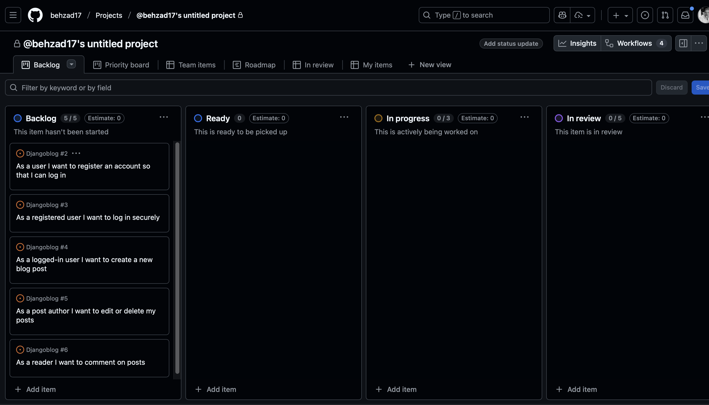

#### 🔹 Ready (items prepared for development)

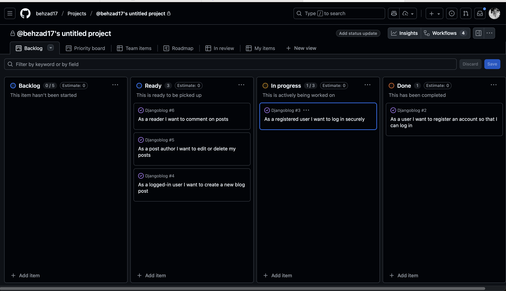

#### 🔹 In Progress (features under active development)

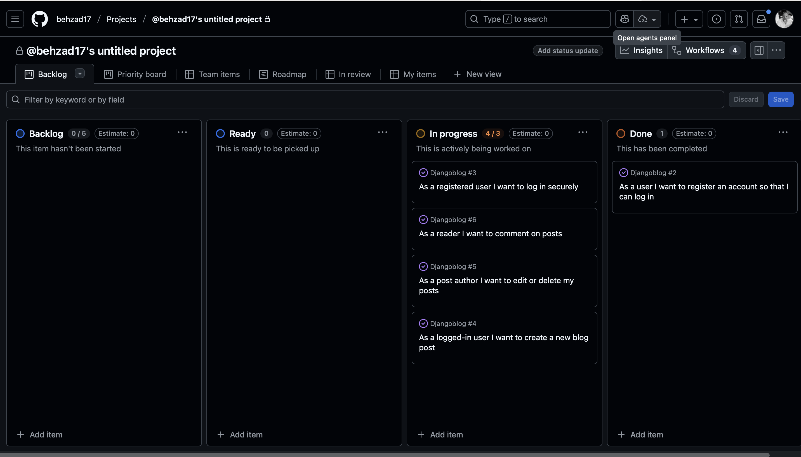

#### 🔹 Done (completed features)

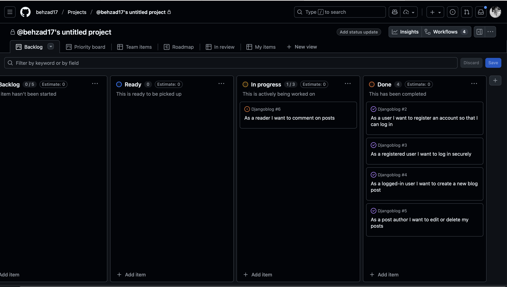

---

### User Stories & Status

- **Done**
- _As a user I want to register an account so that I can log in._
- _As a registered user I want to log in securely so that I can access my profile._

- **In Progress**
- _As a logged-in user I want to create a new blog post._
- _As a post author I want to edit or delete my posts._

- **Ready**
- _As a reader I want to comment on posts._

- **Backlog**
- Currently empty (all items moved forward).

---

## Milestones (Sprints)
The project was divided into 5 sprints:
Sprint 1 – Initial Setup: Django setup, User model, Registration form.
Sprint 2 – Authentication: Login, Logout, Dashboard.
Sprint 3 – Blog CRUD: Create, Edit, Delete posts.
Sprint 4 – Comments + Styling: Comment system, Bootstrap/CSS styling.

#### Milestones
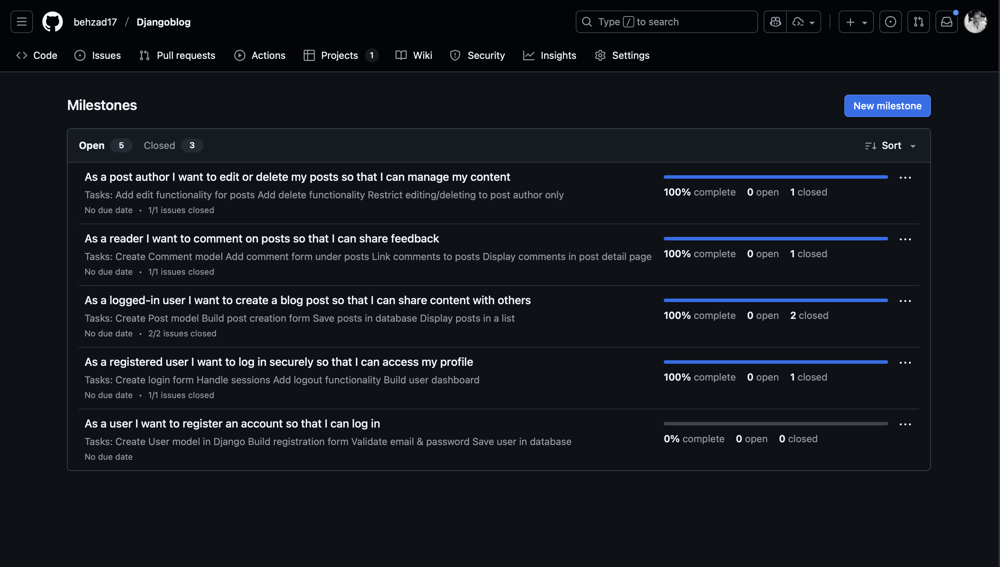
---

## Conclusion

By using Agile methodology with a **Kanban board** on GitHub Projects,  
I was able to track progress visually through each stage of development — from planning to completion.

 

###  Wireframes  

As part of the design process, created  I wireframes for the main pages of the application.  
The wireframes helped visualizing the layout, content structure, and user flow before implementing the actual UI.  

#### 🔹 Main Page (Landing Page)  
- Logo and navigation menu at the top (Home, About, Login, Register).  
- A central heading: *“Read it on our website”* i completed the text now.  
- Grid of blog/article cards with:  
  - Image placeholder  
  - Title (bold text)  
  - Short description/preview text  
- Designed for quick content scanning and responsive layout. 

####  Login Page  
- **Fields**: Email, Password  
- **Action**: Login button  
- **Notes**:  to allow registered users to access their profiles.  

####  Register Page  
- **Fields**: Username, Email, Password, Confirm Password  
- **Action**: Sign Up button  
- **Validation**: Password requirements listed (minimum length, not common, not numeric only, etc.)  
- **Notes**: Focused on user-friendly and secure registration.  

####  Blog Post + Comment Page  
- **Sections**:  
  - Blog title and content area  
  - Author info and timestamp  
  - Comment section with input box and "Add Comment" button  
- **Notes**: Designed to encourage user interaction with clear placement of content and comments.  

 **Wireframe Examples:** 
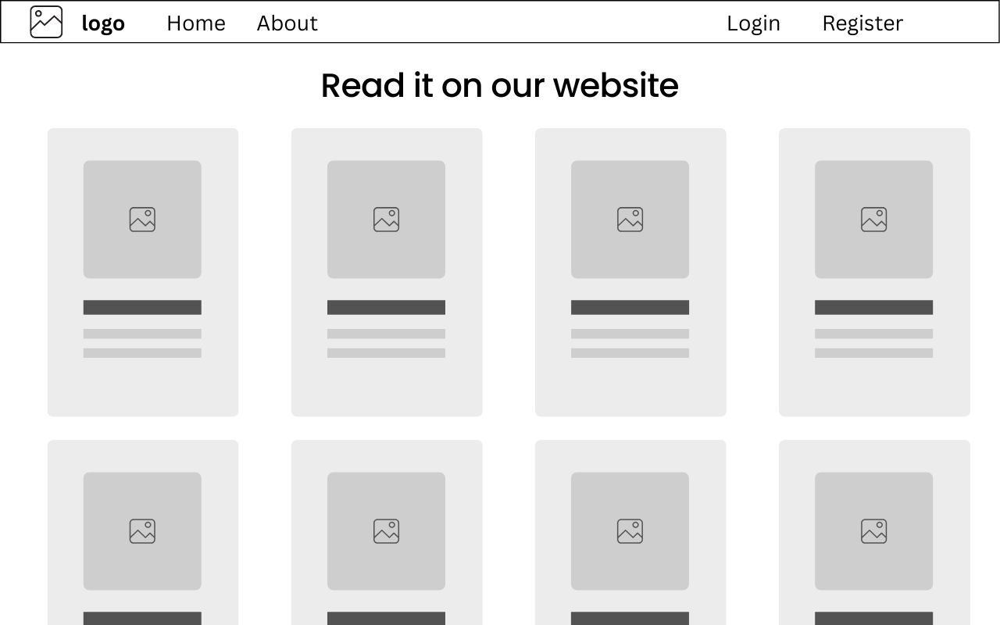
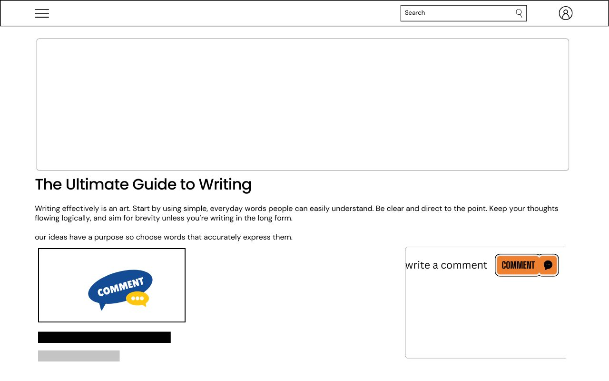 
  
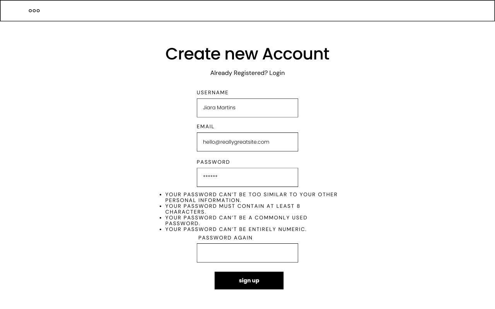  
  

---

###  Color Scheme & Typography  

####  Color Scheme  
The application uses a **clean and modern color palette** to ensure readability and accessibility:  

- **Primary Color:** `#0077b6` → Used for buttons, highlights, and navigation links  
- **Secondary Color:** `#00b4d8` → Supporting accents and hover states  
- **Background Color:** `#ffffff` → Clean white background for maximum readability  
- **Text Color:** `#000000` → Standard black for strong contrast  
- **Border/Muted Elements:** `#e0e0e0` → Used for card borders and subtle separation  

####  Typography  
For typography, a **modern sans-serif font** was selected for simplicity and readability across devices:  

- **Headings (H1, H2, H3):** `Poppins` (Bold, clean, easy to read)  
- **Body Text:** `Roboto` (Regular, highly readable on screens)  
- **Fallback Fonts:** `Arial, sans-serif`  

 This combination ensures that titles stand out while body text remains clear and user-friendly.  

####  Example  
- **Heading Example (H1):** `Sweden Today – Latest News`  
- **Paragraph Example (Body):** `Sweden’s immigrants on edge after mass shooting. The motive behind Sweden’s deadliest mass shooting may never be known but the fact that almost all of the victims …`  

---

 **Summary**  
- Wireframes provided a clear **blueprint** for feature development.  
- The **color scheme & typography** ensure a consistent and accessible UI.  

# Entity Relationship Diagram (ERD)

## User
Represents registered users of the system.
Each user can create multiple posts and comments.
## Post
Represents blog posts created by users.
Each post belongs to exactly one author (User).
Each post can have multiple comments.
## Comment
Represents comments added to a post.
Each comment is linked to both:
the post it belongs to
the author (User) who wrote it
## Relationship summary:
A User can write many Posts.
A User can write many Comments.
A Post can have many Comments. 

##  Testing

###  Manual Testing – Test Plan
The following table outlines the **planned manual test cases** for core features of the application:

| Feature    | Test Case              | Steps                                      |
|------------|------------------------|--------------------------------------------|
| Register   | Valid inputs           | /register → fill valid data → submit        |
| Register   | Weak password          | /register → password `1234` → submit        |
| Login      | Valid credentials      | /login → enter correct creds → submit       |
| Create Post| Valid post             | /posts/new → title+content → submit         |
| Comment    | Logged-out add comment | /posts/:id → submit comment while logged out|
| Responsive | Mobile layout (375px)  | Chrome DevTools → Toggle Device Toolbar     |

---

###  Manual Testing – Test Report
The following table shows the **results of executing the manual tests**:

| Result | Expected Result                          | Steps                                    | Test Case              | Feature    |
|--------|------------------------------------------|------------------------------------------|------------------------|------------|
| ✅     | Account created → redirect to Login      | /register → fill valid data → submit     | Valid inputs           | Register   |
| ✅     | Validation error shown                   | /register → password `1234` → submit     | Weak password          | Register   |
| ✅     | Redirect to Posts list                   | /login → enter correct creds → submit    | Valid credentials      | Login      |
| ✅     | Post visible in list & detail            | /posts/new → title+content → submit      | Valid post             | Create Post|
| ✅     | Login to leave a comment                       | /posts/:id → submit comment while logged out | Logged-out add comment | Comment    |
| ✅     | No horizontal scroll; layout readable    | Chrome DevTools → Toggle Device Toolbar | Mobile layout (375px)  | Responsive |

---

###  Notes
- All manual test cases passed successfully ✅  
- Responsive design tested on Chrome DevTools at **375px (mobile view)**  
- Edge cases (weak passwords, unauthorized comments) behave as expected  
- Future improvements: expand tests for multiple browsers (Google chroom, Safari) and performance under heavy load.

### Screenshots
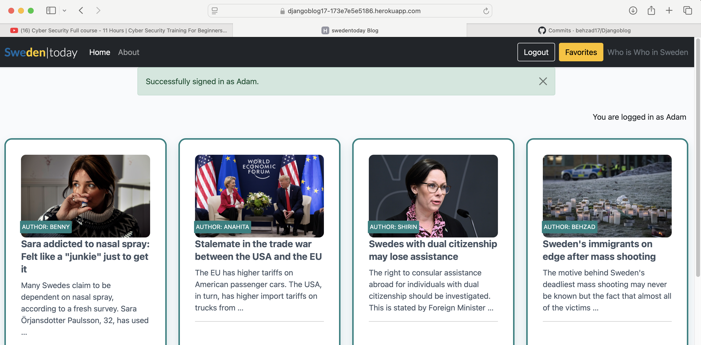

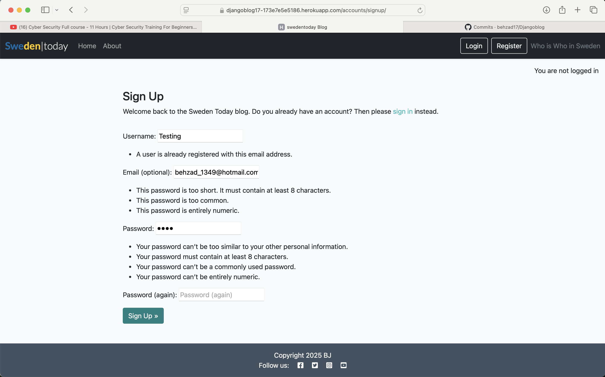

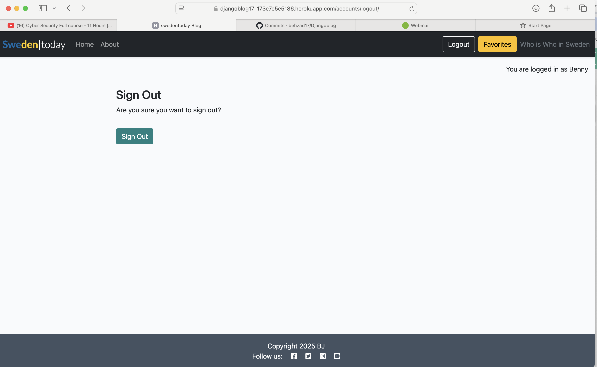

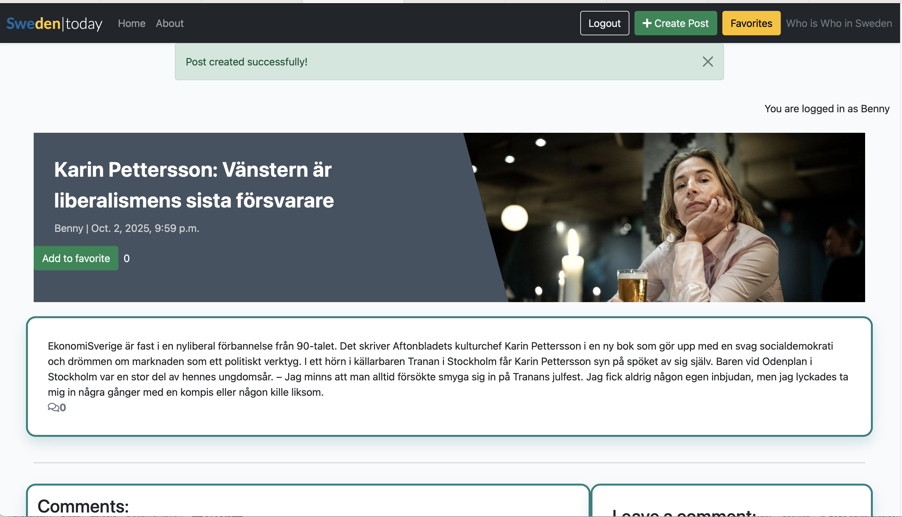

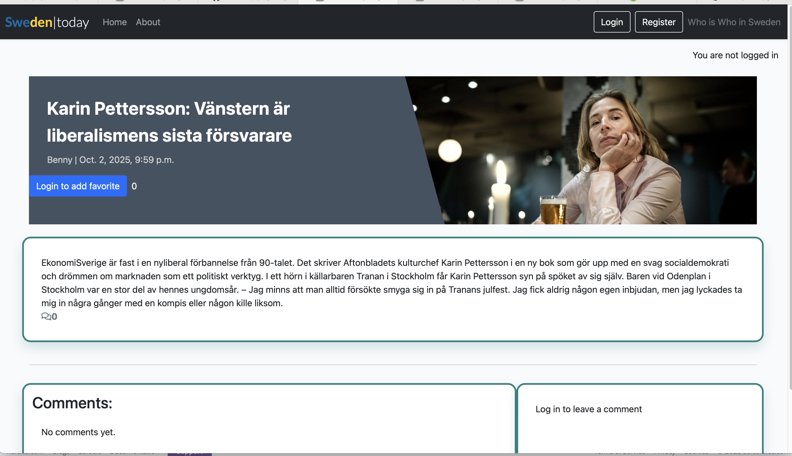

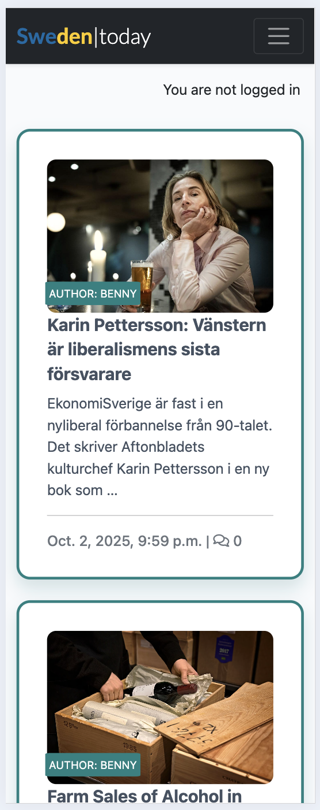

### Automated Tests
Unit tests exist for core views/models. Run:

python manage.py test

## Deployment

Heroku Deployment [The live link is here](https://djangoblog17-173e7e5e5186.herokuapp.com/)

## Media

- The photos used on the home page are from [Sweden Herald](https://swedenherald.com/)
- Icons from [Font Awesome](https://fontawesome.com/)

## Milestones

### Milestone 1: Initial Setup & Core Features

- Set up Django project and basic app structure
- Configure environment variables and PostgreSQL on Heroku
- Add user registration/login using `django-allauth`
- Implement core blog post creation and comment system
- Setup Cloudinary for media handling  
  **Status:** Completed  
  **Completed on:** 2025-02-28

### Milestone 2: UI & UX Enhancement

- Add responsive card design for blog post previews
- Style navbar links: Login, Register, Logout, Favorites using Bootstrap classes
- Add working social links to the footer
- Highlight active navigation tabs
- Design custom 404 error page with return button
- Improve comment edit user experience and layout  
  **Status:** Completed  
  **Completed on:** 2025-03-15

### Milestone 3: Documentation, Testing & Deployment

- Add full testing instructions to `README.md`
- Add deployment steps (Heroku, env vars, Cloudinary)
- Include Wireframes, Mockups, and DB Diagram
- Set `DEBUG = False` in production
- Improve error handling and redirections  
  **Status:** In Progress  
  **Start Date:** 2025-03-15  
  **Due Date:** 2025-03-20
