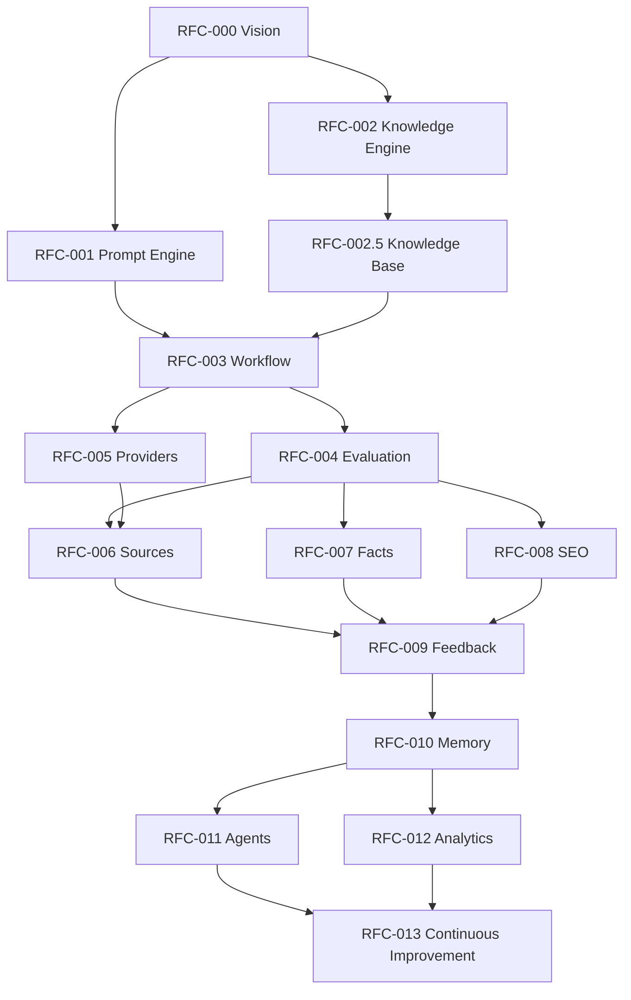

# Peyvand AI — RFC Index

**Parent:** [RFC-000](./RFC-000.md)  
**Roadmap:** [ROADMAP.md](./ROADMAP.md)

Master catalogue of Peyvand AI RFCs. Future RFCs should be registered here when opened.

---

## Catalogue

| RFC | Title | Phase | Status | Notes |
|-----|--------|-------|--------|-------|
| **RFC-000** | AI Product Vision | Governance | Accepted | This programme charter — [RFC-000.md](./RFC-000.md) |
| **RFC-001** | Prompt Engine | 1 Foundation | Done | Versioned modules, builder, validator (inactive in prod path) |
| **RFC-002** | Knowledge Engine | 1 Foundation | Done | Manifest, parser, selectors, injectors (flags off) |
| **RFC-002.5** | Editorial Knowledge Base | 1 Foundation | Done | `sweden` / `community` / `peyvand` content |
| **RFC-003** | Editorial Workflow | 2 Platform | Done (architecture) | Lifecycle orchestrator; inactive (`ENABLE_EDITORIAL_WORKFLOW=False`) |
| **RFC-004** | Prompt Evaluation | 2 Platform | Done (architecture) | Passive metrics/snapshots/reports (`ENABLE_AI_EVALUATION_FRAMEWORK=False`) |
| **RFC-005** | AI Provider Abstraction | 2 Platform | Done (architecture) | Manager/factory/capabilities; OpenAI path unchanged |
| **RFC-006** | Source Intelligence | 3 Intelligence | Partial (APF-001) | URL fetch + readable extract; trust ranking still stubbed |
| **RFC-007** | Fact Checking | 3 Intelligence | Done (architecture) | Passive claim/evidence pipeline (`ENABLE_FACT_CHECKING_FRAMEWORK=False`) |
| **RFC-008** | SEO Intelligence | 3 Intelligence | Planned | SEO assists |
| **RFC-009** | Feedback Learning | 4 Learning | Planned | Learn from editor feedback |
| **RFC-010** | Editorial Memory | 4 Learning | Planned | Persistent editorial context |
| **RFC-011** | AI Editorial Agents | 5 Advanced | Planned | Multi-step agents + human gates |
| **RFC-012** | Analytics | 5 Advanced | Planned | Quality / cost / utilisation |
| **RFC-013** | Continuous Improvement | 5 Advanced | Planned | Governed optimisation loops |
| **APF-001** | AI Editorial Workspace | Product Feature | Done (Intelligence v1 + featured image) | [features/APF-001.md](./features/APF-001.md) — type + goal + style + length; featured image prompt/gen; no auto-publish |
| **APF-001B** | Editorial Featured Image | Product Feature | Done (prompt-first) | [features/APF-001B.md](./features/APF-001B.md) — editable prompt; 16:9 hero; no article regen |
| **APF-002** | AI Studio | Product Feature | Done (compose UI) | [features/APF-002.md](./features/APF-002.md) — admin experiment/eval control centre |
| **ES-000** | Editorial Studio Blueprint | Product | Accepted (design) | [features/ES-000.md](./features/ES-000.md) — newsroom product map |
| **ES-001** | News Import | Product Tool | Superseded by ES-001A | Initial News Import shell |
| **ES-001A** | Smart News Import | Product Tool | Done | [features/ES-001A.md](./features/ES-001A.md) — URL → workflow → Persian draft |

---

## RFC detail blurbs

### RFC-000 — AI Product Vision

Mission, principles, boundaries, governance, and roadmap for Peyvand AI as an Editorial Intelligence Platform.

### RFC-001 — Prompt Engine

Modular prompt behaviour (`v1` system + styles), `PromptBuilder`, `PromptValidator`, AI Engine config. Production generation assembles prompts via `PromptBuilder`.

### RFC-002 — Knowledge Engine

Storage / selection / injection separation; keyword selector stub; no-op injector; disabled feature flags.

### RFC-002.5 — Editorial Knowledge Base

Populates the knowledge engine with Sweden, Community, and Peyvand domains, templates, glossary, and style guide. Passive content only.

### RFC-003 — Editorial Workflow

End-to-end editorial lifecycle states, `WorkflowContext`, stub stage services, and
`WorkflowOrchestrator`. Inactive in production; no auto-publish.

### RFC-004 — Prompt Evaluation

Passive AI Evaluation Framework: snapshots, pluggable metrics, scoring,
comparison, and report builders. Independent from generation stacks.

### RFC-005 — AI Provider Abstraction

Provider platform: registry, factory, manager, capabilities, usage reports.
Existing ``get_provider`` / OpenAI behaviour remain compatible.

### RFC-006 — Source Intelligence

Help editors find and attribute reliable sources for Swedish/community topics.

### RFC-007 — Fact Checking

Passive claim/evidence/confidence/report architecture. Assists editors only;
never auto-publishes or decides absolute truth.

### RFC-008 — SEO Intelligence

Assist titles, leads, and structure without sacrificing accuracy.

### RFC-009 — Feedback Learning

Use editor ratings and edit diffs to improve future suggestions under governance.

### RFC-010 — Editorial Memory

Remember house style preferences and prior decisions without leaking secrets.

### RFC-011 — AI Editorial Agents

Orchestrated multi-step agents with explicit human approval checkpoints.

### RFC-012 — Analytics

Aggregate telemetry into product analytics for quality, latency, cost, and knowledge use.

### RFC-013 — Continuous Improvement

Closed-loop improvement with experiment controls, rollback, and RFC governance.

### ES-000 — Editorial Studio Product Blueprint

Product map for the Peyvand editor newsroom: navigation, shared workflow,
shared result model, tool catalogue, and V1–V3 delivery order. Design only.

### ES-001 — News Import

First Editorial Studio tool: Swedish news URL → Persian draft via the
production workflow. No auto-publish.

---

## Dependency graph

---

## Governance checklist (every new RFC)

Copy into each RFC:

- [ ] Objective  
- [ ] Architecture  
- [ ] Production Safety  
- [ ] Testing Strategy  
- [ ] Migration Strategy  
- [ ] Rollback Strategy  
- [ ] Deliverables  
- [ ] Future Extension Points  

Register the RFC in this index when work starts.
